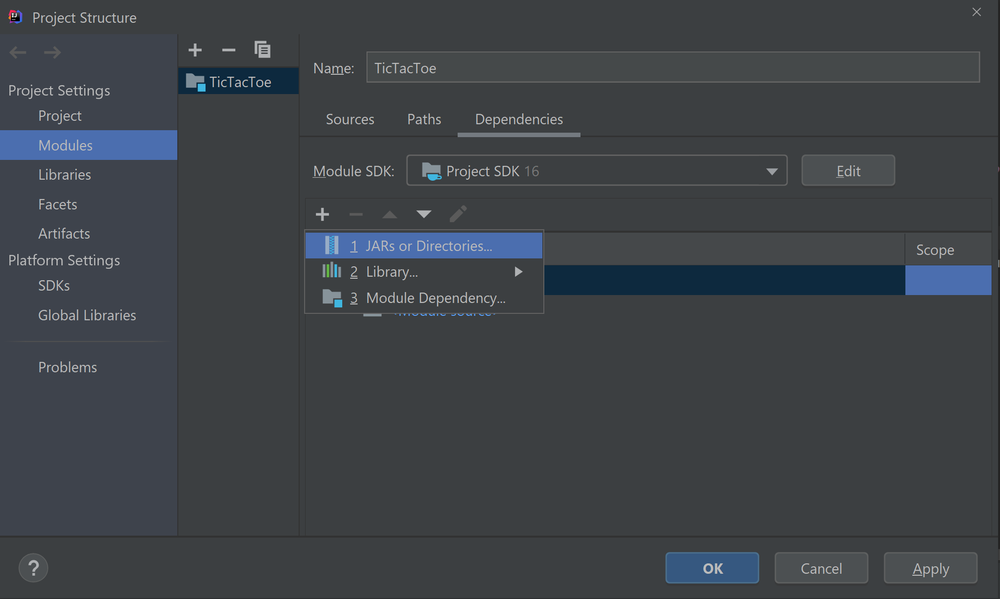
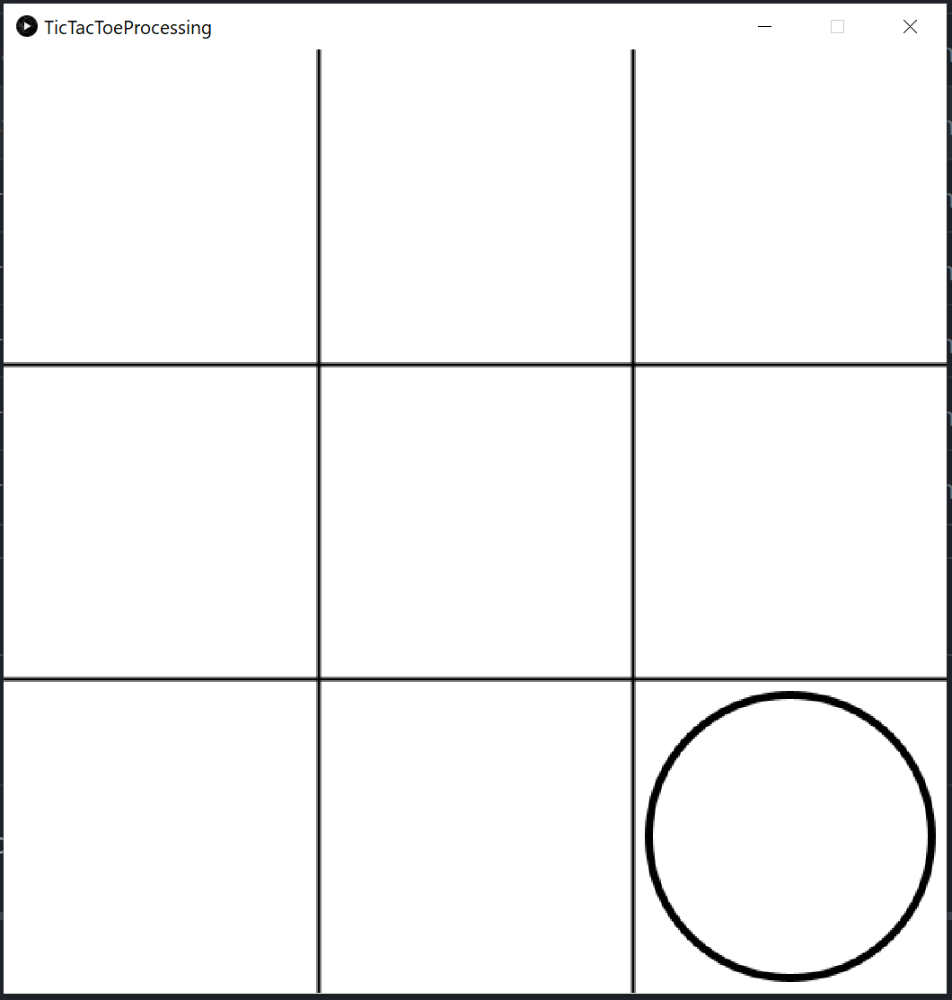
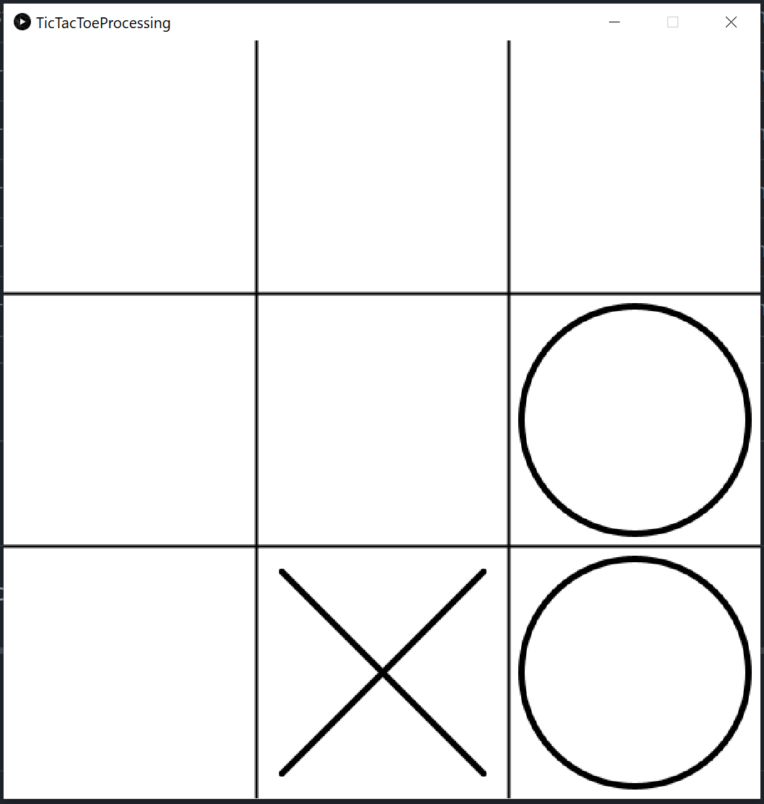
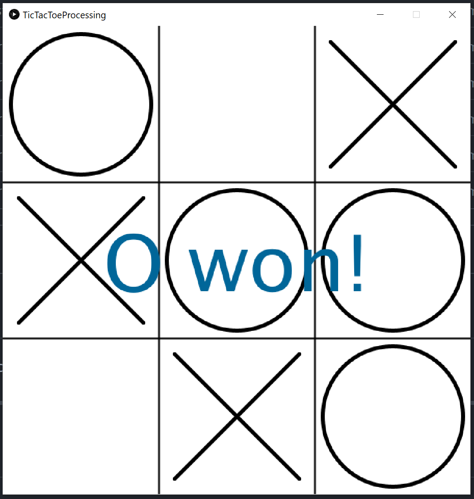

# TicTacToe-AI

### Game of TicTacToe with a GUI where the Computer uses the [Minimax-Algorithm](https://en.wikipedia.org/wiki/Minimax "Minimax")

----------
## Building the Game
To start the Game the core.jar file needs to be added as dependencies, either with a build tool like Gradle or in 
IntelliJ´s Project Settings.

###IntelliJ

------
## Gameplay

The game always starts with the AI's turn (to make it a bit more challenging ;)).

To make your move just click on a free spot. The AI responds after a few milliseconds.
If your first move was not in the center, then the game is already lost.

The AI will test out every possible move before playing, always striving for a win or a draw.

As the AI has the first turn playing and never plays incorrectly, this game is unwinnable.
